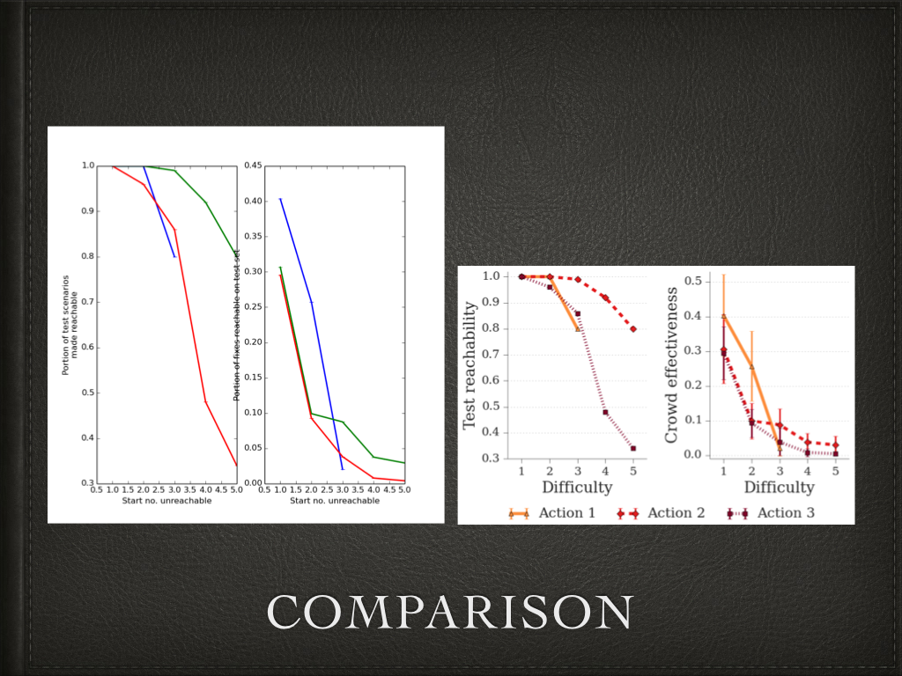

# making-plots-pretty

A talk I gave for our [robotics lab](https://sites.google.com/site/humancenteredrobotics/) on how to make good looking plots / figures.

## Acknowledgments

Thanks to the following folks whose resources I used either as examples of pretty things, or to make my own (somewhat) pretty things.

* [Bilge Mutlu](http://pages.cs.wisc.edu/~bilge/)
* [Ola Botvinnik](http://www.olgabotvinnik.com/) (esp [PrettyPlotLib](http://olgabot.github.io/prettyplotlib/))
* [Cynthia Brewer](http://www.geog.psu.edu/people/brewer-cynthia) (esp [Colorbrewer](http://colorbrewer2.org/))
* [J. Hunter & The Matplotlib Team](http://matplotlib.org/)
* [Loren Shure](http://blogs.mathworks.com/loren/) (esp [this blog post](http://blogs.mathworks.com/loren/2007/12/11/making-pretty-graphs/))
* [Matt Davis](http://penandpants.com/) (esp [brewer2mpl](https://github.com/jiffyclub/brewer2mpl))

## Usage
I slapped an MIT license in here, though it isn't really software. Essentially, if you use these slides, please attribute, though it's most important to acknowledge the folks whose work comprise most of the content of the slides (see 'Acknowledgments' above)!
